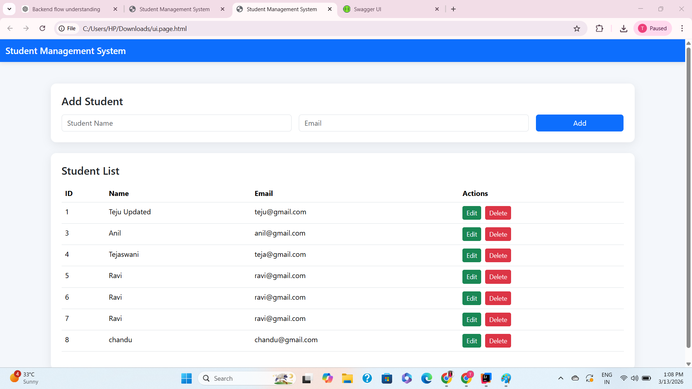
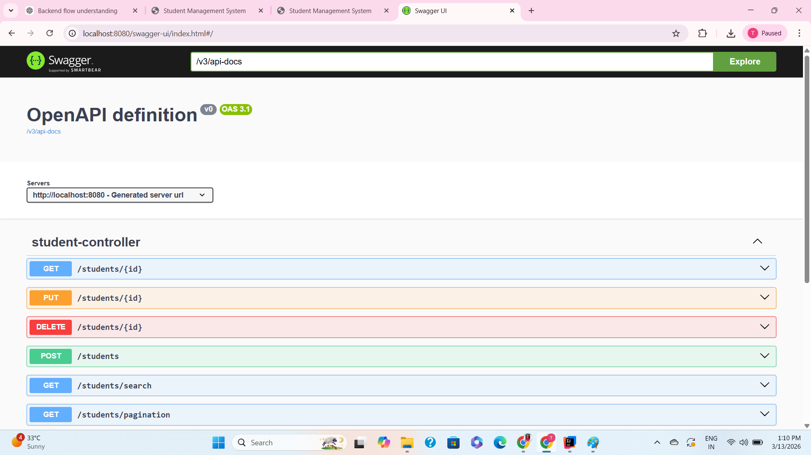

# Student Management System

Full-stack CRUD application built using Spring Boot and MySQL.

## Features
- Add Student
- Update Student
- Delete Student
- Pagination API
- REST architecture

## Tech Stack
- Java
- Spring Boot
- MySQL
- HTML
- Bootstrap
- JavaScript

## API Endpoints

GET /students  
POST /students  
PUT /students/{id}  
DELETE /students/{id}

## Application UI

## API Documentation

## How to Run

1. Clone the repository
2. Run the Spring Boot application
3. Open browser and go to:

http://localhost:8080/index.html

## Author
Tejaswani
